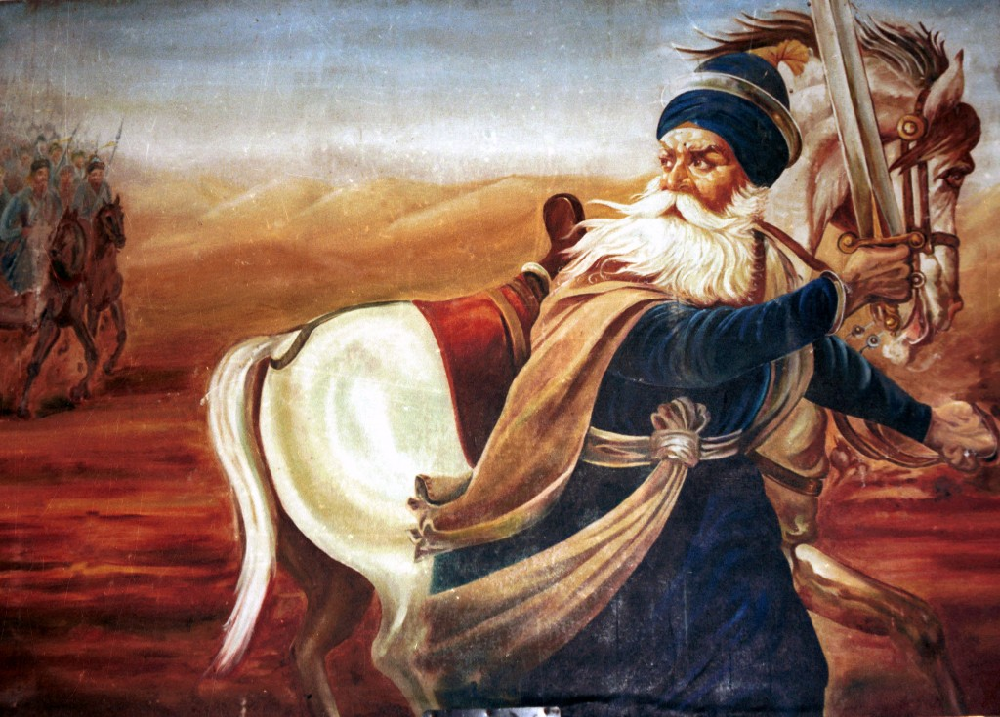

# 
Shaheed Baba Deep Singh Ji

<p1> Baba Deep Singh Ji, a revered Sikh warrior and martyr, valiantly 
  defended the Harmandir Sahib (Golden Temple) and made the 
  ultimate sacrifice in 1757, upholding the sanctity and honor of Sikhi.</p1>

  
$\color{red}{\text{Waheguru Ji Ka Khalsa}}$
$\color{red}{\text{Waheguru Ji Ki Fateh}}$
$\color{red}{\text{The Khalsa belongs to God,}}$
$\color{red}{\text{Victory belongs to God}}$

V&#x0307;02max is maximal oxygen uptake.

<a href="readme.md">Click here to view the readme.md file</a>

<a href="images/picture.jpg">Click here to view picture</a>
